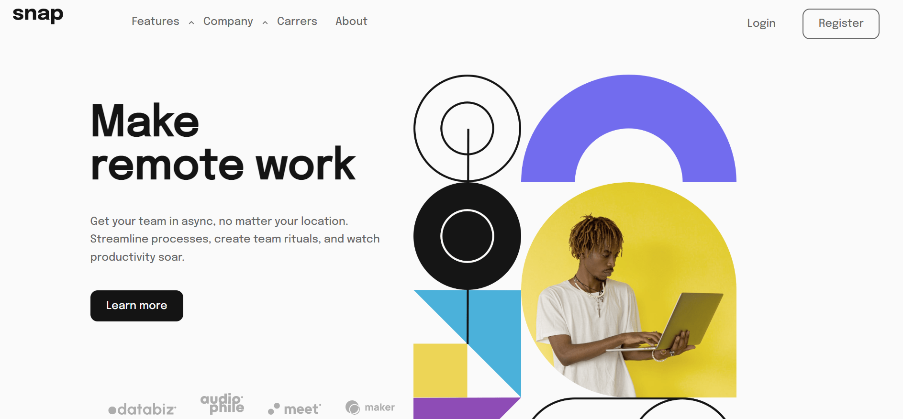

# Frontend Mentor - Intro section with dropdown navigation solution

This is a solution to the [Intro section with dropdown navigation challenge on Frontend Mentor](https://www.frontendmentor.io/challenges/intro-section-with-dropdown-navigation-ryaPetHE5). Frontend Mentor challenges help you improve your coding skills by building realistic projects.

## Table of contents

- [Overview](#overview)
  - [The challenge](#the-challenge)
  - [Screenshot](#screenshot)
- [My process](#my-process)
  - [Built with](#built-with)
  - [What I learned](#what-i-learned)
  - [Continued development](#continued-development)
  - [Useful resources](#useful-resources)
 - [Author](#author)

## Overview

### The challenge

Users should be able to:

- View the relevant dropdown menus on desktop and mobile when interacting with the navigation links
- View the optimal layout for the content depending on their device's screen size
- See hover states for all interactive elements on the page

### Screenshot



## My process

### Built with

- Semantic HTML5 markup
- CSS custom properties
- CSS Box Model
- [React](https://reactjs.org/) - JS library
- TypeScript - Programming Language
- CSS Modules - For styles

### What I learned

How to get the user's screen width to show an appropriate view. If the size changes, the view maybe change too. I wrote a React Custom Hook the deal with this requirement:

```ts
const useViewport = () => {
  const [width, setWidth] = useState(window.screen.width);

  useEffect(() => {
    const resizeObserver = new ResizeObserver(() => {
      setWidth(window.screen.width);
    });

    resizeObserver.observe(document.body);
  }, []);

  return width;
};
```

Thinking in reusability, some UI components were built to used in the entire application:

```ts
const Button = (props: Props) => {
  let btnClasses = classes.btn;

  btnClasses += props.fullSize ? ` ${classes.full} ` : ' ';
  if (props?.variant === 'outlined') {
    btnClasses += classes['btn-outlined'];
  }
  if (props?.variant === 'contained') {
    btnClasses += classes['btn-contained'];
  }

  return <button className={btnClasses}>{props.children}</button>;
};
```

```ts
const Backdrop = (props: Props) => {
  return <div onClick={props.onClick} className={classes.backdrop}></div>;
};
```

### Continued development

While developing this project, I realized that I have to improve one basic skill, CSS. I'm taking Schwarzmüller's CSS course and trying to solve Frontend Mentor Challenges to fill that gap. Furthermore, applying React concepts as important as well.

### Useful resources

- [Hoverable Dropdown](https://www.w3schools.com/howto/howto_css_dropdown.asp) - This helped me building the dropdown menu when hovered.
- [CSS - The Complete Guide 2023](https://www.udemy.com/course/css-the-complete-guide-incl-flexbox-grid-sass/) - This is an amazing CSS course that I'm doing to improve my skills.
- [Developing responsive layouts with React Hooks](https://blog.logrocket.com/developing-responsive-layouts-with-react-hooks/) - This is a blog post that shows how to use React Hooks to develop responsive designs without CSS tools.

## Author

- LinkedIn - [Winstein Martins](https://www.linkedin.com/in/winstein-martins/)
- Frontend Mentor - [@winstein27](https://www.frontendmentor.io/profile/winstein27)

